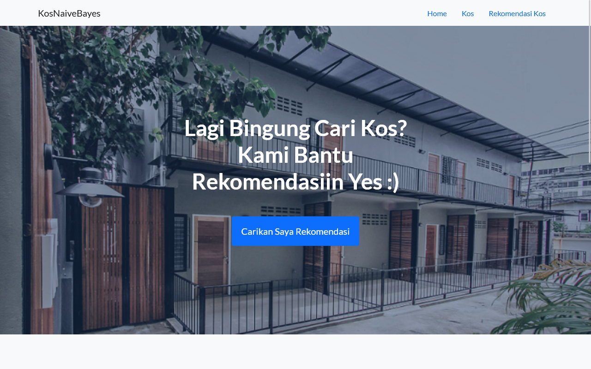
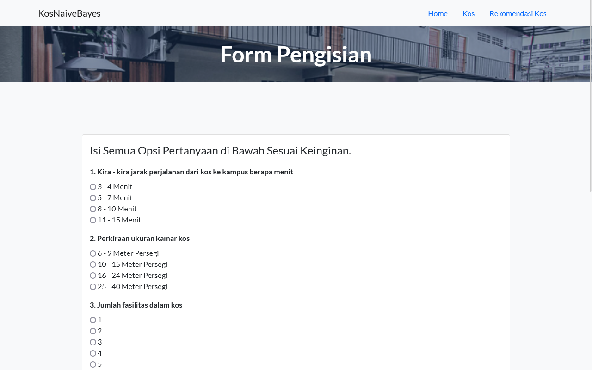
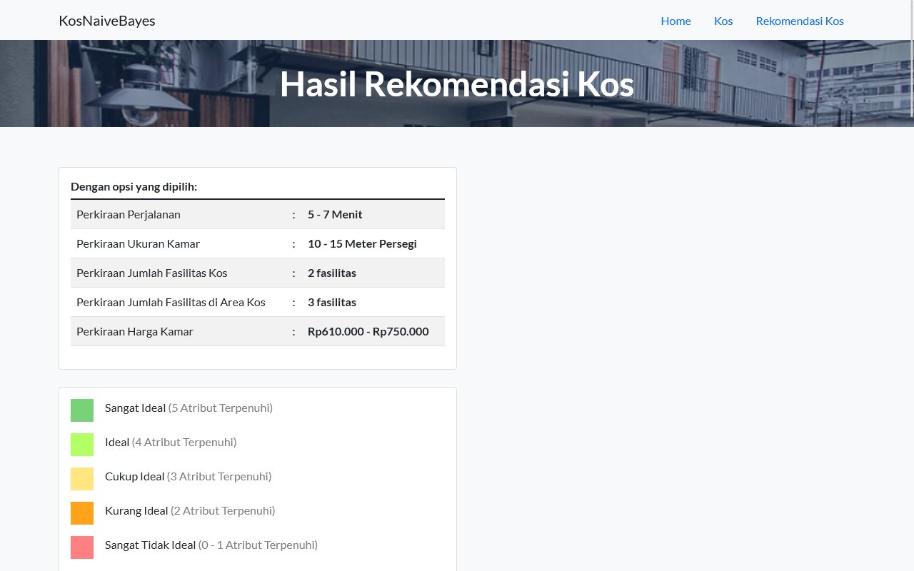
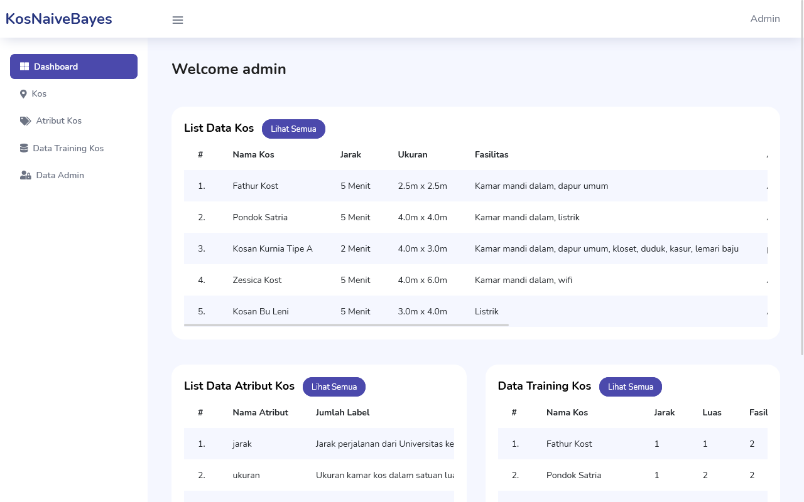

# Kosnaivebayes

A web application of dorm recomendation to new student using Naive Bayes Method.

## Description

When a student study abroad, they have to find a new home in new place. But there are many options for student to take,
so this web apps could recomend list of dorm from excelent to normal dorm.

## Tech Stack

- Python
- Flask
- MySQL
- Javascript
- jQuery
- Bootstrap CSS

## Screenshots

Homepage for Students

Form options for student

Recomendation Results for Students

Dashboard for Admin

## Date Launch

This project started on October 2021 and finished on January 2022
